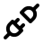
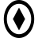
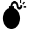
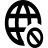
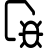
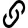

# misp-iconify

Icons and related visual elements for MISP and MISP standard.

## Catalog

<!-- ICONS_START -->


Main icon class:  `misp-icon`
- Hexagone class: `misp-hexagone`
- Simple class: `misp-simple`

| Name | Icon Simple | Icon Hexa | CSS Class |
|------|-------------|------------| ---- |
| `analyst-note` |  |  | `misp-analyst-note` |
| `analyst-opinion` |  |  | `misp-analyst-opinion` |
| `attribute` |  |  | `misp-attribute` |
| `event` |  |  | `misp-event` |
| `galaxy` |  |  | `misp-galaxy` |
| `misp` |  |  | `misp-misp` |
| `object` |  |  | `misp-object` |
| `organisation` |  |  | `misp-organisation` |
| `report` |  |  | `misp-report` |
| `sharing-group` |  |  | `misp-sharing-group` |
| `sighting` |  |  | `misp-sighting` |
| `tag` |  |  | `misp-tag` |
| `taxonomy` |  |  | `misp-taxonomy` |
| `user1` |  |  | `misp-user1` |
| `user2` |  |  | `misp-user2` |
| `user3` |  |  | `misp-user3` |

<!-- ICONS_END -->


### Attribute type icons

<!-- ATTRIBUTE_ICONS_START -->


Icons for **MISP attribute types** (see `describeTypes.json`). Single style,
variant class `misp-attributes`. Filenames are kebab-case, so attribute types
containing `|` or `/` are sanitized to `-` (shown in the *Attribute type* column).

| Attribute type | Icon | File | CSS Class |
|----------------|------|------|-----------|
| `AS` |  | `as.svg` | `misp-as` |
| `attachment` |  | `attachment.svg` | `misp-attachment` |
| `btc` |  | `btc.svg` | `misp-btc` |
| `campaign-name` |  | `campaign-name.svg` | `misp-campaign-name` |
| `cc-number` |  | `cc-number.svg` | `misp-cc-number` |
| `comment` |  | `comment.svg` | `misp-comment` |
| `cookie` |  | `cookie.svg` | `misp-cookie` |
| `cpe` |  | `cpe.svg` | `misp-cpe` |
| `datetime` |  | `datetime.svg` | `misp-datetime` |
| `domain\|ip` |  | `domain-ip.svg` | `misp-domain-ip` |
| `domain` |  | `domain.svg` | `misp-domain` |
| `email-dst` |  | `email-dst.svg` | `misp-email-dst` |
| `email-src` |  | `email-src.svg` | `misp-email-src` |
| `email` |  | `email.svg` | `misp-email` |
| `filename\|md5` |  | `filename-md5.svg` | `misp-filename-md5` |
| `filename\|sha256` |  | `filename-sha256.svg` | `misp-filename-sha256` |
| `filename` |  | `filename.svg` | `misp-filename` |
| `full-name` |  | `full-name.svg` | `misp-full-name` |
| `github-username` |  | `github-username.svg` | `misp-github-username` |
| `hostname` |  | `hostname.svg` | `misp-hostname` |
| `iban` |  | `iban.svg` | `misp-iban` |
| `ip-dst\|port` |  | `ip-dst-port.svg` | `misp-ip-dst-port` |
| `ip-dst` |  | `ip-dst.svg` | `misp-ip-dst` |
| `ip-src` |  | `ip-src.svg` | `misp-ip-src` |
| `link` |  | `link.svg` | `misp-link` |
| `mac-address` |  | `mac-address.svg` | `misp-mac-address` |
| `malware-sample` |  | `malware-sample.svg` | `misp-malware-sample` |
| `md5` |  | `md5.svg` | `misp-md5` |
| `mutex` |  | `mutex.svg` | `misp-mutex` |
| `pattern-in-file` |  | `pattern-in-file.svg` | `misp-pattern-in-file` |
| `pgp-public-key` |  | `pgp-public-key.svg` | `misp-pgp-public-key` |
| `phone-number` |  | `phone-number.svg` | `misp-phone-number` |
| `port` |  | `port.svg` | `misp-port` |
| `regkey` |  | `regkey.svg` | `misp-regkey` |
| `sha1` |  | `sha1.svg` | `misp-sha1` |
| `sha256` |  | `sha256.svg` | `misp-sha256` |
| `sigma` |  | `sigma.svg` | `misp-sigma` |
| `snort` |  | `snort.svg` | `misp-snort` |
| `ssh-fingerprint` |  | `ssh-fingerprint.svg` | `misp-ssh-fingerprint` |
| `text` |  | `text.svg` | `misp-text` |
| `threat-actor` |  | `threat-actor.svg` | `misp-threat-actor` |
| `twitter-id` |  | `twitter-id.svg` | `misp-twitter-id` |
| `uri` |  | `uri.svg` | `misp-uri` |
| `url` |  | `url.svg` | `misp-url` |
| `user-agent` |  | `user-agent.svg` | `misp-user-agent` |
| `vulnerability` |  | `vulnerability.svg` | `misp-vulnerability` |
| `windows-scheduled-task` |  | `windows-scheduled-task.svg` | `misp-windows-scheduled-task` |
| `windows-service-name` |  | `windows-service-name.svg` | `misp-windows-service-name` |
| `x509-fingerprint-sha1` |  | `x509-fingerprint-sha1.svg` | `misp-x509-fingerprint-sha1` |
| `yara` |  | `yara.svg` | `misp-yara` |

<!-- ATTRIBUTE_ICONS_END -->


### Object icons

<!-- OBJECT_ICONS_START -->


Icons for **MISP objects**, imported from the [`misp-objects`](https://github.com/MISP/misp-objects)
submodule. Single style, variant class `misp-objects`. Use them like any other
icon: `<i class="misp-icon misp-icon-<name> misp-objects"></i>`.

Names marked † also exist as a core or attribute icon; they stay separate
thanks to the `misp-objects` variant class, so both render independently.

| Object | Icon | File | CSS classes |
|--------|------|------|-------------|
| `android-app` |  | `android-app.svg` | `misp-icon misp-icon-android-app misp-objects` |
| `android-permission` |  | `android-permission.svg` | `misp-icon misp-icon-android-permission misp-objects` |
| `annotation` |  | `annotation.svg` | `misp-icon misp-icon-annotation misp-objects` |
| `apk` |  | `apk.svg` | `misp-icon misp-icon-apk misp-objects` |
| `artifact` |  | `artifact.svg` | `misp-icon misp-icon-artifact misp-objects` |
| `asn` |  | `asn.svg` | `misp-icon misp-icon-asn misp-objects` |
| `attack-pattern` |  | `attack-pattern.svg` | `misp-icon misp-icon-attack-pattern misp-objects` |
| `av-signature` |  | `av-signature.svg` | `misp-icon misp-icon-av-signature misp-objects` |
| `bank-account` |  | `bank-account.svg` | `misp-icon misp-icon-bank-account misp-objects` |
| `blog` |  | `blog.svg` | `misp-icon misp-icon-blog misp-objects` |
| `btc-transaction` |  | `btc-transaction.svg` | `misp-icon misp-icon-btc-transaction misp-objects` |
| `btc-wallet` |  | `btc-wallet.svg` | `misp-icon misp-icon-btc-wallet misp-objects` |
| `c2-list` |  | `c2-list.svg` | `misp-icon misp-icon-c2-list misp-objects` |
| `chat-message` |  | `chat-message.svg` | `misp-icon misp-icon-chat-message misp-objects` |
| `coin-address` |  | `coin-address.svg` | `misp-icon misp-icon-coin-address misp-objects` |
| `command-line` |  | `command-line.svg` | `misp-icon misp-icon-command-line misp-objects` |
| `command` |  | `command.svg` | `misp-icon misp-icon-command misp-objects` |
| `cookie` † |  | `cookie.svg` | `misp-icon misp-icon-cookie misp-objects` |
| `course-of-action` |  | `course-of-action.svg` | `misp-icon misp-icon-course-of-action misp-objects` |
| `cpe-asset` |  | `cpe-asset.svg` | `misp-icon misp-icon-cpe-asset misp-objects` |
| `credential` |  | `credential.svg` | `misp-icon misp-icon-credential misp-objects` |
| `credit-card` |  | `credit-card.svg` | `misp-icon misp-icon-credit-card misp-objects` |
| `crypto-material` |  | `crypto-material.svg` | `misp-icon misp-icon-crypto-material misp-objects` |
| `data-url` |  | `data-url.svg` | `misp-icon misp-icon-data-url misp-objects` |
| `ddos-config` |  | `ddos-config.svg` | `misp-icon misp-icon-ddos-config misp-objects` |
| `ddos` |  | `ddos.svg` | `misp-icon misp-icon-ddos misp-objects` |
| `decoded-barcode` |  | `decoded-barcode.svg` | `misp-icon misp-icon-decoded-barcode misp-objects` |
| `decoded-qrcode` |  | `decoded-qrcode.svg` | `misp-icon misp-icon-decoded-qrcode misp-objects` |
| `device` |  | `device.svg` | `misp-icon misp-icon-device misp-objects` |
| `diamond` |  | `diamond.svg` | `misp-icon misp-icon-diamond misp-objects` |
| `directory` |  | `directory.svg` | `misp-icon misp-icon-directory misp-objects` |
| `dkim` |  | `dkim.svg` | `misp-icon misp-icon-dkim misp-objects` |
| `dns-record` |  | `dns-record.svg` | `misp-icon misp-icon-dns-record misp-objects` |
| `domain-ip` † |  | `domain-ip.svg` | `misp-icon misp-icon-domain-ip misp-objects` |
| `elf` |  | `elf.svg` | `misp-icon misp-icon-elf misp-objects` |
| `email` † |  | `email.svg` | `misp-icon misp-icon-email misp-objects` |
| `employee` |  | `employee.svg` | `misp-icon misp-icon-employee misp-objects` |
| `event` † |  | `event.svg` | `misp-icon misp-icon-event misp-objects` |
| `exploit-poc` |  | `exploit-poc.svg` | `misp-icon misp-icon-exploit-poc misp-objects` |
| `exploit` |  | `exploit.svg` | `misp-icon misp-icon-exploit misp-objects` |
| `facebook-account` |  | `facebook-account.svg` | `misp-icon misp-icon-facebook-account misp-objects` |
| `facebook-group` |  | `facebook-group.svg` | `misp-icon misp-icon-facebook-group misp-objects` |
| `facebook-page` |  | `facebook-page.svg` | `misp-icon misp-icon-facebook-page misp-objects` |
| `facebook-post` |  | `facebook-post.svg` | `misp-icon misp-icon-facebook-post misp-objects` |
| `facebook-reaction` |  | `facebook-reaction.svg` | `misp-icon misp-icon-facebook-reaction misp-objects` |
| `favicon` |  | `favicon.svg` | `misp-icon misp-icon-favicon misp-objects` |
| `file-7z` |  | `file-7z.svg` | `misp-icon misp-icon-file-7z misp-objects` |
| `file-apk` |  | `file-apk.svg` | `misp-icon misp-icon-file-apk misp-objects` |
| `file-bat` |  | `file-bat.svg` | `misp-icon misp-icon-file-bat misp-objects` |
| `file-css` |  | `file-css.svg` | `misp-icon misp-icon-file-css misp-objects` |
| `file-csv` |  | `file-csv.svg` | `misp-icon misp-icon-file-csv misp-objects` |
| `file-dll` |  | `file-dll.svg` | `misp-icon misp-icon-file-dll misp-objects` |
| `file-doc` |  | `file-doc.svg` | `misp-icon misp-icon-file-doc misp-objects` |
| `file-docx` |  | `file-docx.svg` | `misp-icon misp-icon-file-docx misp-objects` |
| `file-elf` |  | `file-elf.svg` | `misp-icon misp-icon-file-elf misp-objects` |
| `file-eml` |  | `file-eml.svg` | `misp-icon misp-icon-file-eml misp-objects` |
| `file-exe` |  | `file-exe.svg` | `misp-icon misp-icon-file-exe misp-objects` |
| `file-gif` |  | `file-gif.svg` | `misp-icon misp-icon-file-gif misp-objects` |
| `file-gz` |  | `file-gz.svg` | `misp-icon misp-icon-file-gz misp-objects` |
| `file-html` |  | `file-html.svg` | `misp-icon misp-icon-file-html misp-objects` |
| `file-iso` |  | `file-iso.svg` | `misp-icon misp-icon-file-iso misp-objects` |
| `file-jar` |  | `file-jar.svg` | `misp-icon misp-icon-file-jar misp-objects` |
| `file-jpg` |  | `file-jpg.svg` | `misp-icon misp-icon-file-jpg misp-objects` |
| `file-json` |  | `file-json.svg` | `misp-icon misp-icon-file-json misp-objects` |
| `file-js` |  | `file-js.svg` | `misp-icon misp-icon-file-js misp-objects` |
| `file-lnk` |  | `file-lnk.svg` | `misp-icon misp-icon-file-lnk misp-objects` |
| `file-mp3` |  | `file-mp3.svg` | `misp-icon misp-icon-file-mp3 misp-objects` |
| `file-mp4` |  | `file-mp4.svg` | `misp-icon misp-icon-file-mp4 misp-objects` |
| `file-msg` |  | `file-msg.svg` | `misp-icon misp-icon-file-msg misp-objects` |
| `file-pcap` |  | `file-pcap.svg` | `misp-icon misp-icon-file-pcap misp-objects` |
| `file-pdf` |  | `file-pdf.svg` | `misp-icon misp-icon-file-pdf misp-objects` |
| `file-png` |  | `file-png.svg` | `misp-icon misp-icon-file-png misp-objects` |
| `file-ppt` |  | `file-ppt.svg` | `misp-icon misp-icon-file-ppt misp-objects` |
| `file-pptx` |  | `file-pptx.svg` | `misp-icon misp-icon-file-pptx misp-objects` |
| `file-ps1` |  | `file-ps1.svg` | `misp-icon misp-icon-file-ps1 misp-objects` |
| `file-py` |  | `file-py.svg` | `misp-icon misp-icon-file-py misp-objects` |
| `file-rar` |  | `file-rar.svg` | `misp-icon misp-icon-file-rar misp-objects` |
| `file-rtf` |  | `file-rtf.svg` | `misp-icon misp-icon-file-rtf misp-objects` |
| `file-sh` |  | `file-sh.svg` | `misp-icon misp-icon-file-sh misp-objects` |
| `file` |  | `file.svg` | `misp-icon misp-icon-file misp-objects` |
| `file-svg` |  | `file-svg.svg` | `misp-icon misp-icon-file-svg misp-objects` |
| `file-txt` |  | `file-txt.svg` | `misp-icon misp-icon-file-txt misp-objects` |
| `file-vbs` |  | `file-vbs.svg` | `misp-icon misp-icon-file-vbs misp-objects` |
| `file-xls` |  | `file-xls.svg` | `misp-icon misp-icon-file-xls misp-objects` |
| `file-xlsx` |  | `file-xlsx.svg` | `misp-icon misp-icon-file-xlsx misp-objects` |
| `file-xml` |  | `file-xml.svg` | `misp-icon misp-icon-file-xml misp-objects` |
| `file-zip` |  | `file-zip.svg` | `misp-icon misp-icon-file-zip misp-objects` |
| `forensic-case` |  | `forensic-case.svg` | `misp-icon misp-icon-forensic-case misp-objects` |
| `forensic-evidence` |  | `forensic-evidence.svg` | `misp-icon misp-icon-forensic-evidence misp-objects` |
| `forged-document` |  | `forged-document.svg` | `misp-icon misp-icon-forged-document misp-objects` |
| `geojson` |  | `geojson.svg` | `misp-icon misp-icon-geojson misp-objects` |
| `geolocation` |  | `geolocation.svg` | `misp-icon misp-icon-geolocation misp-objects` |
| `ghidra-function` |  | `ghidra-function.svg` | `misp-icon misp-icon-ghidra-function misp-objects` |
| `github-action` |  | `github-action.svg` | `misp-icon misp-icon-github-action misp-objects` |
| `github-repo` |  | `github-repo.svg` | `misp-icon misp-icon-github-repo misp-objects` |
| `github-user` |  | `github-user.svg` | `misp-icon misp-icon-github-user misp-objects` |
| `gitlab-user` |  | `gitlab-user.svg` | `misp-icon misp-icon-gitlab-user misp-objects` |
| `google-account` |  | `google-account.svg` | `misp-icon misp-icon-google-account misp-objects` |
| `google-threat-intelligence-report` |  | `google-threat-intelligence-report.svg` | `misp-icon misp-icon-google-threat-intelligence-report misp-objects` |
| `gpx` |  | `gpx.svg` | `misp-icon misp-icon-gpx misp-objects` |
| `http-request` |  | `http-request.svg` | `misp-icon misp-icon-http-request misp-objects` |
| `identity` |  | `identity.svg` | `misp-icon misp-icon-identity misp-objects` |
| `image` |  | `image.svg` | `misp-icon misp-icon-image misp-objects` |
| `impersonation` |  | `impersonation.svg` | `misp-icon misp-icon-impersonation misp-objects` |
| `incident` |  | `incident.svg` | `misp-icon misp-icon-incident misp-objects` |
| `infrastructure` |  | `infrastructure.svg` | `misp-icon misp-icon-infrastructure misp-objects` |
| `instagram-account` |  | `instagram-account.svg` | `misp-icon misp-icon-instagram-account misp-objects` |
| `instant-message` |  | `instant-message.svg` | `misp-icon misp-icon-instant-message misp-objects` |
| `intelligence-report` |  | `intelligence-report.svg` | `misp-icon misp-icon-intelligence-report misp-objects` |
| `intrusion-set` |  | `intrusion-set.svg` | `misp-icon misp-icon-intrusion-set misp-objects` |
| `iot-device` |  | `iot-device.svg` | `misp-icon misp-icon-iot-device misp-objects` |
| `iot-firmware` |  | `iot-firmware.svg` | `misp-icon misp-icon-iot-firmware misp-objects` |
| `ip-port` |  | `ip-port.svg` | `misp-icon misp-icon-ip-port misp-objects` |
| `irc` |  | `irc.svg` | `misp-icon misp-icon-irc misp-objects` |
| `ja3` |  | `ja3.svg` | `misp-icon misp-icon-ja3 misp-objects` |
| `keybase-account` |  | `keybase-account.svg` | `misp-icon misp-icon-keybase-account misp-objects` |
| `leaked-document` |  | `leaked-document.svg` | `misp-icon misp-icon-leaked-document misp-objects` |
| `legal-entity` |  | `legal-entity.svg` | `misp-icon misp-icon-legal-entity misp-objects` |
| `lnk` |  | `lnk.svg` | `misp-icon misp-icon-lnk misp-objects` |
| `macho` |  | `macho.svg` | `misp-icon misp-icon-macho misp-objects` |
| `malicious-website` |  | `malicious-website.svg` | `misp-icon misp-icon-malicious-website misp-objects` |
| `malware-analysis` |  | `malware-analysis.svg` | `misp-icon misp-icon-malware-analysis misp-objects` |
| `malware-config` |  | `malware-config.svg` | `misp-icon misp-icon-malware-config misp-objects` |
| `malware` |  | `malware.svg` | `misp-icon misp-icon-malware misp-objects` |
| `microblog` |  | `microblog.svg` | `misp-icon misp-icon-microblog misp-objects` |
| `mutex` † |  | `mutex.svg` | `misp-icon misp-icon-mutex misp-objects` |
| `netflow` |  | `netflow.svg` | `misp-icon misp-icon-netflow misp-objects` |
| `network-connection` |  | `network-connection.svg` | `misp-icon misp-icon-network-connection misp-objects` |
| `network-data` |  | `network-data.svg` | `misp-icon misp-icon-network-data misp-objects` |
| `network-profile` |  | `network-profile.svg` | `misp-icon misp-icon-network-profile misp-objects` |
| `network-socket` |  | `network-socket.svg` | `misp-icon misp-icon-network-socket misp-objects` |
| `network-traffic` |  | `network-traffic.svg` | `misp-icon misp-icon-network-traffic misp-objects` |
| `news-agency` |  | `news-agency.svg` | `misp-icon misp-icon-news-agency misp-objects` |
| `news-media` |  | `news-media.svg` | `misp-icon misp-icon-news-media misp-objects` |
| `nse-script` |  | `nse-script.svg` | `misp-icon misp-icon-nse-script misp-objects` |
| `organization` |  | `organization.svg` | `misp-icon misp-icon-organization misp-objects` |
| `passive-dns-dnsdbflex` |  | `passive-dns-dnsdbflex.svg` | `misp-icon misp-icon-passive-dns-dnsdbflex misp-objects` |
| `passive-dns` |  | `passive-dns.svg` | `misp-icon misp-icon-passive-dns misp-objects` |
| `passive-ssh` |  | `passive-ssh.svg` | `misp-icon misp-icon-passive-ssh misp-objects` |
| `paste` |  | `paste.svg` | `misp-icon misp-icon-paste misp-objects` |
| `personification` |  | `personification.svg` | `misp-icon misp-icon-personification misp-objects` |
| `person` |  | `person.svg` | `misp-icon misp-icon-person misp-objects` |
| `pe-section` |  | `pe-section.svg` | `misp-icon misp-icon-pe-section misp-objects` |
| `pe` |  | `pe.svg` | `misp-icon misp-icon-pe misp-objects` |
| `phishing-kit` |  | `phishing-kit.svg` | `misp-icon misp-icon-phishing-kit misp-objects` |
| `phishing` |  | `phishing.svg` | `misp-icon misp-icon-phishing misp-objects` |
| `phone-number` † |  | `phone-number.svg` | `misp-icon misp-icon-phone-number misp-objects` |
| `phone` |  | `phone.svg` | `misp-icon misp-icon-phone misp-objects` |
| `physical-impact` |  | `physical-impact.svg` | `misp-icon misp-icon-physical-impact misp-objects` |
| `postal-address` |  | `postal-address.svg` | `misp-icon misp-icon-postal-address misp-objects` |
| `process` |  | `process.svg` | `misp-icon misp-icon-process misp-objects` |
| `query` |  | `query.svg` | `misp-icon misp-icon-query misp-objects` |
| `reddit-account` |  | `reddit-account.svg` | `misp-icon misp-icon-reddit-account misp-objects` |
| `reddit-comment` |  | `reddit-comment.svg` | `misp-icon misp-icon-reddit-comment misp-objects` |
| `reddit-post` |  | `reddit-post.svg` | `misp-icon misp-icon-reddit-post misp-objects` |
| `reddit-subreddit` |  | `reddit-subreddit.svg` | `misp-icon misp-icon-reddit-subreddit misp-objects` |
| `regexp` |  | `regexp.svg` | `misp-icon misp-icon-regexp misp-objects` |
| `registry-key` |  | `registry-key.svg` | `misp-icon misp-icon-registry-key misp-objects` |
| `registry-key-value` |  | `registry-key-value.svg` | `misp-icon misp-icon-registry-key-value misp-objects` |
| `report` † |  | `report.svg` | `misp-icon misp-icon-report misp-objects` |
| `risk-assessment-report` |  | `risk-assessment-report.svg` | `misp-icon misp-icon-risk-assessment-report misp-objects` |
| `sandbox-report` |  | `sandbox-report.svg` | `misp-icon misp-icon-sandbox-report misp-objects` |
| `scan-result` |  | `scan-result.svg` | `misp-icon misp-icon-scan-result misp-objects` |
| `scheduled-event` |  | `scheduled-event.svg` | `misp-icon misp-icon-scheduled-event misp-objects` |
| `scheduled-task` |  | `scheduled-task.svg` | `misp-icon misp-icon-scheduled-task misp-objects` |
| `script` |  | `script.svg` | `misp-icon misp-icon-script misp-objects` |
| `service` |  | `service.svg` | `misp-icon misp-icon-service misp-objects` |
| `shell-commands` |  | `shell-commands.svg` | `misp-icon misp-icon-shell-commands misp-objects` |
| `shortened-link` |  | `shortened-link.svg` | `misp-icon misp-icon-shortened-link misp-objects` |
| `software-package` |  | `software-package.svg` | `misp-icon misp-icon-software-package misp-objects` |
| `software` |  | `software.svg` | `misp-icon misp-icon-software misp-objects` |
| `spearphishing-attachment` |  | `spearphishing-attachment.svg` | `misp-icon misp-icon-spearphishing-attachment misp-objects` |
| `spearphishing-campaign` |  | `spearphishing-campaign.svg` | `misp-icon misp-icon-spearphishing-campaign misp-objects` |
| `spearphishing-link` |  | `spearphishing-link.svg` | `misp-icon misp-icon-spearphishing-link misp-objects` |
| `splunk` |  | `splunk.svg` | `misp-icon misp-icon-splunk misp-objects` |
| `ssh-authorized-keys` |  | `ssh-authorized-keys.svg` | `misp-icon misp-icon-ssh-authorized-keys misp-objects` |
| `stix2-pattern` |  | `stix2-pattern.svg` | `misp-icon misp-icon-stix2-pattern misp-objects` |
| `suricata` |  | `suricata.svg` | `misp-icon misp-icon-suricata misp-objects` |
| `task` |  | `task.svg` | `misp-icon misp-icon-task misp-objects` |
| `telegram-account` |  | `telegram-account.svg` | `misp-icon misp-icon-telegram-account misp-objects` |
| `telegram-bot` |  | `telegram-bot.svg` | `misp-icon misp-icon-telegram-bot misp-objects` |
| `temporal-event` |  | `temporal-event.svg` | `misp-icon misp-icon-temporal-event misp-objects` |
| `terminal-output` |  | `terminal-output.svg` | `misp-icon misp-icon-terminal-output misp-objects` |
| `timestamp` |  | `timestamp.svg` | `misp-icon misp-icon-timestamp misp-objects` |
| `tor-hiddenservice` |  | `tor-hiddenservice.svg` | `misp-icon misp-icon-tor-hiddenservice misp-objects` |
| `tor-node` |  | `tor-node.svg` | `misp-icon misp-icon-tor-node misp-objects` |
| `transaction` |  | `transaction.svg` | `misp-icon misp-icon-transaction misp-objects` |
| `translation` |  | `translation.svg` | `misp-icon misp-icon-translation misp-objects` |
| `transport-ticket` |  | `transport-ticket.svg` | `misp-icon misp-icon-transport-ticket misp-objects` |
| `twitter-account` |  | `twitter-account.svg` | `misp-icon misp-icon-twitter-account misp-objects` |
| `twitter-list` |  | `twitter-list.svg` | `misp-icon misp-icon-twitter-list misp-objects` |
| `twitter-post` |  | `twitter-post.svg` | `misp-icon misp-icon-twitter-post misp-objects` |
| `uav` |  | `uav.svg` | `misp-icon misp-icon-uav misp-objects` |
| `url` † |  | `url.svg` | `misp-icon misp-icon-url misp-objects` |
| `user-account` |  | `user-account.svg` | `misp-icon misp-icon-user-account misp-objects` |
| `user-action` |  | `user-action.svg` | `misp-icon misp-icon-user-action misp-objects` |
| `vehicle` |  | `vehicle.svg` | `misp-icon misp-icon-vehicle misp-objects` |
| `victim` |  | `victim.svg` | `misp-icon misp-icon-victim misp-objects` |
| `virustotal-graph` |  | `virustotal-graph.svg` | `misp-icon misp-icon-virustotal-graph misp-objects` |
| `virustotal-report` |  | `virustotal-report.svg` | `misp-icon misp-icon-virustotal-report misp-objects` |
| `virustotal-submission` |  | `virustotal-submission.svg` | `misp-icon misp-icon-virustotal-submission misp-objects` |
| `vulnerability` † |  | `vulnerability.svg` | `misp-icon misp-icon-vulnerability misp-objects` |
| `weakness` |  | `weakness.svg` | `misp-icon misp-icon-weakness misp-objects` |
| `whois` |  | `whois.svg` | `misp-icon misp-icon-whois misp-objects` |
| `wifi-connection` |  | `wifi-connection.svg` | `misp-icon misp-icon-wifi-connection misp-objects` |
| `windows-service` |  | `windows-service.svg` | `misp-icon misp-icon-windows-service misp-objects` |
| `x509` |  | `x509.svg` | `misp-icon misp-icon-x509 misp-objects` |
| `x-header` |  | `x-header.svg` | `misp-icon misp-icon-x-header misp-objects` |
| `yara` † |  | `yara.svg` | `misp-icon misp-icon-yara misp-objects` |
| `youtube-channel` |  | `youtube-channel.svg` | `misp-icon misp-icon-youtube-channel misp-objects` |
| `youtube-comment` |  | `youtube-comment.svg` | `misp-icon misp-icon-youtube-comment misp-objects` |
| `youtube-playlist` |  | `youtube-playlist.svg` | `misp-icon misp-icon-youtube-playlist misp-objects` |
| `youtube-video` |  | `youtube-video.svg` | `misp-icon misp-icon-youtube-video misp-objects` |

<!-- OBJECT_ICONS_END -->


## Usage

Icons inherit color and size from CSS (currentColor, font-size).

### SVG (direct file)
```html
<!-- For the event with the hexagone shape  -->

```

### CSS
```html
<link rel="stylesheet" href="./exports/css/icons.css" />
...
<!-- For the event with the hexagone shape  -->
<i class="misp-icon misp-hexagone misp-event"></i>

<!-- An attribute-type icon (single style) -->
<i class="misp-icon misp-icon-vulnerability misp-attributes"></i>

<!-- The object icon of the same name — namespaced by the misp-objects class -->
<i class="misp-icon misp-icon-vulnerability misp-objects"></i>
```

Each icon is a compound selector `.misp-icon-<name>.misp-<variant>`, so the
same name in different variants (e.g. the `vulnerability` attribute icon and the
`vulnerability` object icon) never collides — pick one with its variant class.


## Object icons (misp-objects submodule)

Object icons are **not** authored here: they are imported from the
[`misp-objects`](https://github.com/MISP/misp-objects) repository, vendored as a
git submodule at `vendor/misp-objects` (tracking the `main` branch).

```bash
git submodule update --init vendor/misp-objects   # first checkout
make fetch-objects                                 # import into src/svg/objects
make all                                            # rebuild PNG/WebP/CSS/catalog
```

`fetch-objects` copies every conforming `objects/<name>/icon/icon.svg` (plus the
`file/icon/file-*.svg` type variants) into `src/svg/objects/`, strips the root
`<svg>` dimensions, and records provenance under `objects/<name>` keys in
`metadata/icons.json`. Full-colour / non-`currentColor` upstream logos are
skipped automatically and listed in the command output.


## Contribution Rules

- `src/svg` is the source of truth
- Never edit generated PNGs manually
- SVG filenames must use kebab-case
<!-- - Icons should use a 24x24 viewBox -->
- Icons should use the fill=`currentColor`
- Icons provenance is tracked in `metadata/icons.json`
- Object icons (`src/svg/objects`) are imported via `make fetch-objects`; edit them upstream in `misp-objects`, not here


## Attribution

<!-- ATTRIBUTION_START -->

This project includes icons from third-party sources that require attribution.

- **as** → tabler:affiliate (source: Tabler Icons, license: MIT, url: https://tabler.io/icons)
- **attachment** → tabler:paperclip (source: Tabler Icons, license: MIT, url: https://tabler.io/icons)
- **btc** → tabler:currency-bitcoin (source: Tabler Icons, license: MIT, url: https://tabler.io/icons)
- **campaign-name** → tabler:flag (source: Tabler Icons, license: MIT, url: https://tabler.io/icons)
- **cc-number** → tabler:credit-card (source: Tabler Icons, license: MIT, url: https://tabler.io/icons)
- **comment** → tabler:message (source: Tabler Icons, license: MIT, url: https://tabler.io/icons)
- **cookie** → tabler:cookie (source: Tabler Icons, license: MIT, url: https://tabler.io/icons)
- **cpe** → tabler:package (source: Tabler Icons, license: MIT, url: https://tabler.io/icons)
- **datetime** → tabler:clock (source: Tabler Icons, license: MIT, url: https://tabler.io/icons)
- **domain** → tabler:world (source: Tabler Icons, license: MIT, url: https://tabler.io/icons)
- **domain-ip** → tabler:route (source: Tabler Icons, license: MIT, url: https://tabler.io/icons)
- **email** → tabler:mail (source: Tabler Icons, license: MIT, url: https://tabler.io/icons)
- **email-dst** → tabler:mail-down (source: Tabler Icons, license: MIT, url: https://tabler.io/icons)
- **email-src** → tabler:mail-forward (source: Tabler Icons, license: MIT, url: https://tabler.io/icons)
- **filename** → tabler:file (source: Tabler Icons, license: MIT, url: https://tabler.io/icons)
- **filename-md5** → tabler:file-digit (source: Tabler Icons, license: MIT, url: https://tabler.io/icons)
- **filename-sha256** → tabler:file-digit (source: Tabler Icons, license: MIT, url: https://tabler.io/icons)
- **full-name** → tabler:user (source: Tabler Icons, license: MIT, url: https://tabler.io/icons)
- **github-username** → tabler:brand-github (source: Tabler Icons, license: MIT, url: https://tabler.io/icons)
- **hostname** → tabler:server (source: Tabler Icons, license: MIT, url: https://tabler.io/icons)
- **iban** → tabler:building-bank (source: Tabler Icons, license: MIT, url: https://tabler.io/icons)
- **ip-dst** → tabler:world-download (source: Tabler Icons, license: MIT, url: https://tabler.io/icons)
- **ip-dst-port** → tabler:plug-connected (source: Tabler Icons, license: MIT, url: https://tabler.io/icons)
- **ip-src** → tabler:world-upload (source: Tabler Icons, license: MIT, url: https://tabler.io/icons)
- **link** → tabler:external-link (source: Tabler Icons, license: MIT, url: https://tabler.io/icons)
- **mac-address** → tabler:id (source: Tabler Icons, license: MIT, url: https://tabler.io/icons)
- **malware-sample** → tabler:bug (source: Tabler Icons, license: MIT, url: https://tabler.io/icons)
- **md5** → tabler:hash (source: Tabler Icons, license: MIT, url: https://tabler.io/icons)
- **mutex** → tabler:lock (source: Tabler Icons, license: MIT, url: https://tabler.io/icons)
- **pattern-in-file** → tabler:file-search (source: Tabler Icons, license: MIT, url: https://tabler.io/icons)
- **pgp-public-key** → tabler:shield-lock (source: Tabler Icons, license: MIT, url: https://tabler.io/icons)
- **phone-number** → tabler:phone (source: Tabler Icons, license: MIT, url: https://tabler.io/icons)
- **port** → tabler:plug (source: Tabler Icons, license: MIT, url: https://tabler.io/icons)
- **regkey** → tabler:key (source: Tabler Icons, license: MIT, url: https://tabler.io/icons)
- **sha1** → tabler:hash (source: Tabler Icons, license: MIT, url: https://tabler.io/icons)
- **sha256** → tabler:hash (source: Tabler Icons, license: MIT, url: https://tabler.io/icons)
- **sigma** → tabler:sum (source: Tabler Icons, license: MIT, url: https://tabler.io/icons)
- **snort** → tabler:radar (source: Tabler Icons, license: MIT, url: https://tabler.io/icons)
- **ssh-fingerprint** → tabler:fingerprint (source: Tabler Icons, license: MIT, url: https://tabler.io/icons)
- **text** → tabler:file-text (source: Tabler Icons, license: MIT, url: https://tabler.io/icons)
- **threat-actor** → tabler:spy (source: Tabler Icons, license: MIT, url: https://tabler.io/icons)
- **twitter-id** → tabler:brand-x (source: Tabler Icons, license: MIT, url: https://tabler.io/icons)
- **uri** → tabler:link (source: Tabler Icons, license: MIT, url: https://tabler.io/icons)
- **url** → tabler:link (source: Tabler Icons, license: MIT, url: https://tabler.io/icons)
- **user-agent** → tabler:browser (source: Tabler Icons, license: MIT, url: https://tabler.io/icons)
- **vulnerability** → tabler:shield-exclamation (source: Tabler Icons, license: MIT, url: https://tabler.io/icons)
- **windows-scheduled-task** → tabler:calendar-time (source: Tabler Icons, license: MIT, url: https://tabler.io/icons)
- **windows-service-name** → tabler:settings (source: Tabler Icons, license: MIT, url: https://tabler.io/icons)
- **x509-fingerprint-sha1** → tabler:certificate (source: Tabler Icons, license: MIT, url: https://tabler.io/icons)
- **yara** → tabler:file-code (source: Tabler Icons, license: MIT, url: https://tabler.io/icons)

<!-- ATTRIBUTION_END -->
